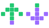

<p align="center">
  
</p>

<h1 align="center">LinkedIn Open-to-Work & Hiring Tracker</h1>

<p align="center"><a href="https://dschinkel.github.io/linkedin-open-to-work-hiring-tracker/demo/followers"><strong>▶ Try the live demo</strong></a> (sample data, nothing from LinkedIn)</p>
<p align="center"><em>Who in your network is looking for work, how many, and who's hiring, tracked over time.</em></p>

The goal is a clearer picture of how your close network of connections is doing, not a single snapshot.

### Disclaimer (ok?)
This app is semi-vibe-coded, meaning it's using some of my XP rules but not all.  I did not run it through my vflow orchestrator.  So kinda half baked. It is what it is, some good, some bad; don't expect super clean or superb test coverage 😆.  It's just to find out some quick stats.

---

## Running it

**Needs:** Node.js 26.10+ (`nvm install && nvm use` reads `.nvmrc`) and pnpm 12+.

```bash
pnpm install
pnpm dev
```

Open <http://localhost:5173>.

Next, grab a [screenshot](#taking-screenshots-required) of your followers or connections.

### Demo

<https://dschinkel.github.io/linkedin-open-to-work-hiring-tracker/demo/followers> (or **Demo** in the app header). It runs in your browser with fictional data: 800 followers and 500 connections over 180 days. Every chart zooms like a stock chart: drag the handles under it.

For sample data in your local dashboards (kept in memory; your database isn't touched): `TRACKER_SAMPLE=full pnpm dev`.

### Scripts

| Command | What it does |
|---|---|
| `pnpm dev` | App, API, database, and inbox watchers, with live reload |
| `pnpm server` | Just the API on port 3001 (headless, for scripts) |
| `pnpm test` | All tests: React hooks and views, analytics, the screenshot reader, SQLite, and headless HTTP tests of the Koa server |
| `pnpm typecheck` | TypeScript check |
| `pnpm lint` | oxlint |
| `pnpm build` | Production build |

---

## Taking screenshots (required)

The app never logs into LinkedIn, crawls profiles, or automates your browser. **You** take screenshots, and the app does the rest.

### Followers or connections: pick what you track

It's up to you whether you gauge your **followers** or your **connections**, or both. The app keeps them as two **separate dashboards**, and the **Followers / Connections** toggle in the header switches between them. Each has its own trends, hiring list, scans, settings, and inbox folder:

| Dashboard | Screenshot this LinkedIn list | Inbox folder |
|---|---|---|
| Connections | <https://www.linkedin.com/mynetwork/invite-connect/connections/> | `LinkedinScreenShots/contacts/` |
| Followers | Your followers list (Me → View profile → Followers): <https://www.linkedin.com/mynetwork/network-manager/people-follow/followers/> | `LinkedinScreenShots/followers/` |

**Keep each dashboard consistent.** Only ever drop connections screenshots into Connections and followers screenshots into Followers. Mixing them would make people appear and disappear between scans, which shows up as fake transitions, fake unfollowers, and a jumpy rate.

> **Zoom matters:** set the browser to **67% zoom** (`Cmd+0`, then `Cmd+-` four times). That fits about 24 people per screenshot on a laptop screen and keeps each photo big enough to read the #OPENTOWORK / #HIRING frame. Anything from 67% to 100% works; below 50% frames can't be read, and those people are marked Uncertain.
>
> | Zoom | People per screenshot (laptop) | Screenshots for ~1,450 people |
> |---|---|---|
> | 100% | ~16 | ~105 |
> | **67% (recommended)** | ~24 | ~65 |
> | 50% (minimum) | ~32 | ~50 |
>
> **Zoom shortcuts (Chrome, Brave, Edge, Firefox):**
>
> | Mac | Windows / Linux | What it does |
> |---|---|---|
> | `Cmd+0` | `Ctrl+0` | Reset to 100% |
> | `Cmd+-` | `Ctrl+-` | Zoom out one step (100 → 90 → 80 → 75 → 67 → 50 → 33%) |
> | `Cmd+=` (or `Cmd++`) | `Ctrl+=` (or `Ctrl++`) | Zoom in one step |
>
> From 100%, pressing `Cmd+-` **four times** lands on **67%**. The browser briefly shows the zoom level in the address bar. Safari has no 67% step; use 75% there.
>
> **The threshold:** each profile photo must be at least **40 pixels wide in the screenshot image**. On a Retina Mac that's about **50% zoom**; at 33% photos are ~30px and frames can't be read (tested: 0 of 5 frames read, and some names misread). On a non-Retina screen photos are half as many pixels, so stay at **100%** there.
>
> Any number of screenshots can be dropped at once; they're read one by one. Let each screenshot overlap the previous by a row or two so nobody is skipped; duplicates are filtered out.

###  Easiest: GoFullPage (Chrome or Brave)
> **Heads-up: GoFullPage carries some risk.** It captures the page by scrolling it automatically, and LinkedIn may treat automated scrolling or capturing as scraping by an application. That could get your account flagged or restricted. If you want to be sure you won't get dinged, scroll and take the screenshots yourself (see below).

1. Install [GoFullPage – Full Page Screen Capture](https://chromewebstore.google.com/detail/gofullpage-full-page-scre/fdpohaocaechififmbbbbbknoalclacl) in Chrome or Brave.
2. Open the list you track (connections or followers)
3. Scroll down until everyone you want to track has loaded
4. Click the GoFullPage icon (or press `Alt+Shift+P`). It captures the whole scrolled page as a single image
5. Download the screenshot as a PNG or better, just one PDF, and drag onto the **drop box** on that dashboard

**A PDF is the easiest source.** In GoFullPage's result tab, choose **Download PDF** instead of the image, then drop that PDF on the drop box. One file holds your whole list, and each page is read like its own screenshot (see [A PDF of screenshots](#a-pdf-of-screenshots)).


###  Scroll and take screenshots yourself

This is the safest option because nothing is automated: you scroll LinkedIn like any normal visitor and use your operating system's own screenshot tool. No browser extension or app touches the LinkedIn page, so there is nothing for LinkedIn to flag as scraping.

Scroll manually and take screenshots as you go. On macOS:

`Shift+Cmd+3`: capture the whole screen<br>
`Shift+Cmd+4`: drag to capture just the list of people<br>
`Shift+Cmd+5`: open the screenshot toolbar (screen, window, or selection, plus where to save)

Overlapping screenshots are fine, because people are de-duplicated. macOS names such as `Screenshot 2026-09-22 at 9.01.12 AM.png` are dated automatically.

### A PDF of screenshots

You can also drop a PDF whose pages are screenshots (for example, several screenshots exported as one PDF). Each page is drawn as its own screenshot, named `<pdf name> - page N.png`, at twice the page size or the resolution of the picture on the page, whichever is sharper. Put the date in the PDF's name (for example `followers 2026-09-22.pdf`) to date the scan; otherwise it's dated the day you drop it. PDFs are only read when dropped in the app: a PDF copied straight into an inbox folder is skipped, and the server log says so.

### Screenshot rules

1. Drop screenshots on the Dashboard, or copy them into that dashboard's inbox folder. They're read straight away; there's no button.
2. Screenshots from the same date make one scan, even across several uploads.
3. Overlap is fine: each person is counted once, matched by name, headline, and company (never by face).
4. Keep avatars, names, and headlines visible.
5. Scan regularly (daily or weekly) so there's history to compare.

### What happens to your screenshots

Each screenshot is read the moment it arrives: people, headlines, and both frames are saved to your local database, and **the screenshot is then deleted**. One that can't be read (blurry, not a LinkedIn list) is left in the inbox so you can see what went wrong. To keep an archived copy of each one instead, choose *Keep an archived copy* in Settings.

Screenshots and the database are **git-ignored**, so they're never committed or pushed. **Recommendation: never push your screenshots**, not even to a private fork; they show other people's names and photos, and the database already holds what you need. (To keep them in a private fork anyway, remove `LinkedinScreenShots/*`, `!LinkedinScreenShots/.gitkeep`, and `data/` from `.gitignore`.)

### Where your data lives

Everything is in **`data/linkedin.sqlite`**, one file on your computer, created automatically the first time you run the app.

| Table | What it holds |
|---|---|
| `people` | Everyone seen: an identity hash, name, headline, company |
| `scans` | One row per day: cards found, duplicates removed |
| `observations` | Each person on each day: #OPEN_TO_WORK and #HIRING, with confidence |
| `screenshots` | Every screenshot added: waiting, imported, or failed (and why) |
| `settings` | Your Settings choices |

Followers and Connections share the file but never mix. It survives restarts and updates, but **git doesn't back it up**: copy `data/linkedin.sqlite` somewhere safe now and then (or let Time Machine do it). Open it with any SQLite tool, e.g. `sqlite3 data/linkedin.sqlite`.

---

## Pages

Each page exists for **Followers** and **Connections**; the header toggle switches between them and keeps you on the same page.

 latest numbers, rate trend, entry vs removal, who's hiring, scan quality, daily history, and the screenshot drop box.

 zoomable, synced charts: rate and moving averages, raw vs matched cohort, entries vs removals, net flow, how long people stay open, hiring trends, and a grid of Open to Work by job title.

 everyone seen with #HIRING, searchable and filterable, plus counts per company.

 /  people missing from your last 3 scans, and whether they were Open to Work or Hiring when last seen.

Only reliable when each scan covers your whole list, since a screenshot can't prove someone left.

 daily history; click a day for its screenshots and quality. **Export** saves everyone in that scan (name, headline, company, Open to Work, Hiring) as a spreadsheet (.xlsx), PDF, or CSV, e.g. `followers-2026-09-22.xlsx`; the Scans page can export the latest scan. The Open to Work and Hiring pages export their list as shown (search, filters, sort), e.g. `connections-hiring-2026-09-23.pdf`.

 inbox and archive folders, what happens after import, thresholds, reminders, and **Clear all data** (asks you to confirm first).

## How the metrics are defined

| Metric | What it means |
|---|---|
| Open-to-Work rate | % of people showing the #OPEN_TO_WORK frame (unclear avatars skipped) |
| Hiring rate | % of people showing the #HIRING frame (people, not job openings) |
| Change | Measured in percentage points (`pp`) |
| Newly open / removed | Only counts people seen in both scans |
| Entry rate | % of not-open people who became open |
| Removal rate | % of open people who stopped showing it |
| Entry / exit ratio | New opens per removal (`—` when there were no removals) |
| Matched-cohort rate | The rate among only people seen in both scans |
| Moving averages | Average of the scans you actually took; missing days are skipped |
| Observed duration | Days between the frame appearing and disappearing |

## How screenshots are read

1. **Find the people.** The app finds the column of round profile photos. Every name beside it is a person, including people with an empty photo.
2. **Read names and titles.** The strip of text beside the photos is enlarged and read with OCR (tesseract.js), so zoomed-out screenshots still work. Titles that can't be read are left blank rather than guessed.
3. **Read the frame.** Each photo is checked for an unbroken green (#OPENTOWORK) or purple (#HIRING) band with a label printed on it. A green shirt or purple background doesn't count, and anything unclear is marked Uncertain.

No face recognition, and nothing leaves your machine.

It's tested on LinkedIn-style screenshots with fictional people (`server/screenshots/fixtures/`, regenerated with `node scripts/render-screenshot-fixtures.mjs`). If your real screenshots read poorly, open an issue with the zoom level you used.
